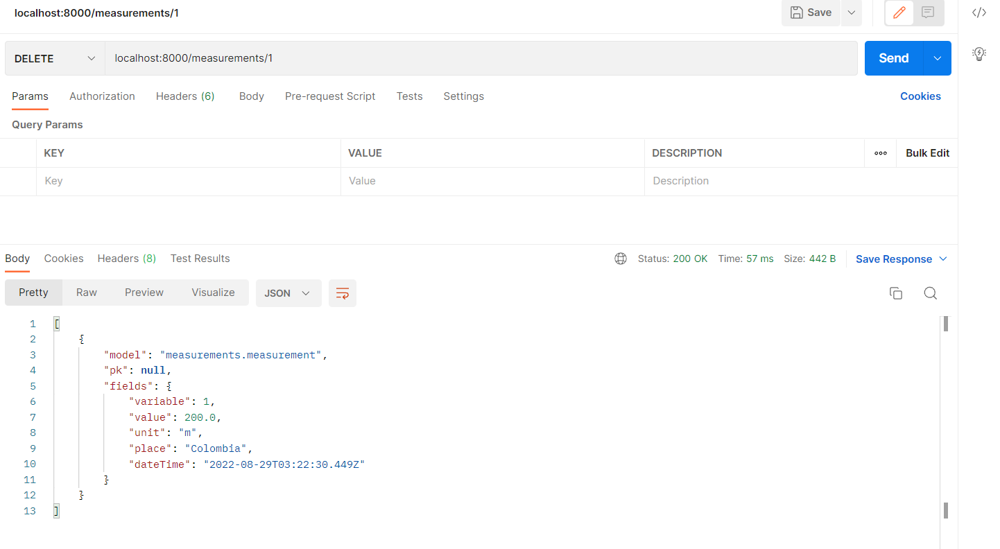

# Monitoring Views Workshop

* if you want a easy installation use **pipenv\*** else use **requirements.txt**

**pipenv:** can be installed wih:

```bash
pip install pipenv
```

dont forget to check if you have the right python version: 3.8

* Executing with pipenv 
```bash
pipenv run python {command}
```
Example:
```bash
pipenv run python manage.py makemigrations 
```

## Imágenes de los JSON
### Crear Measurement


### GET Measurements


### GET Measurement


### PUT Measurement


### DELETE Measurements


Las pruebas POSTMAN de Meadurements están en el archivo "Measurements.postman_collection.json"